# Hello 👋

<table>
	<tr>
	    <td width="60%" align="center" valign="top">
			
		</td>
		<td width="40%" valign="top">
			I'm Swaruph, a CSE student, Java developer, open source contributor, and Linux enthusiast. I enjoy building applications while actively contributing to open source projects. Currently, I'm working on <b>cmdzen</b>.
		</td>
	</tr>
</table>

## Languages & Tools

 

## Languages activity

